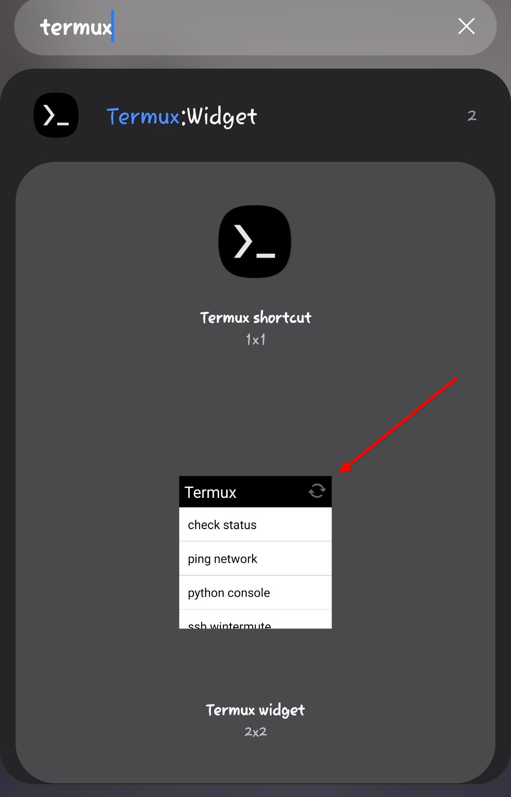
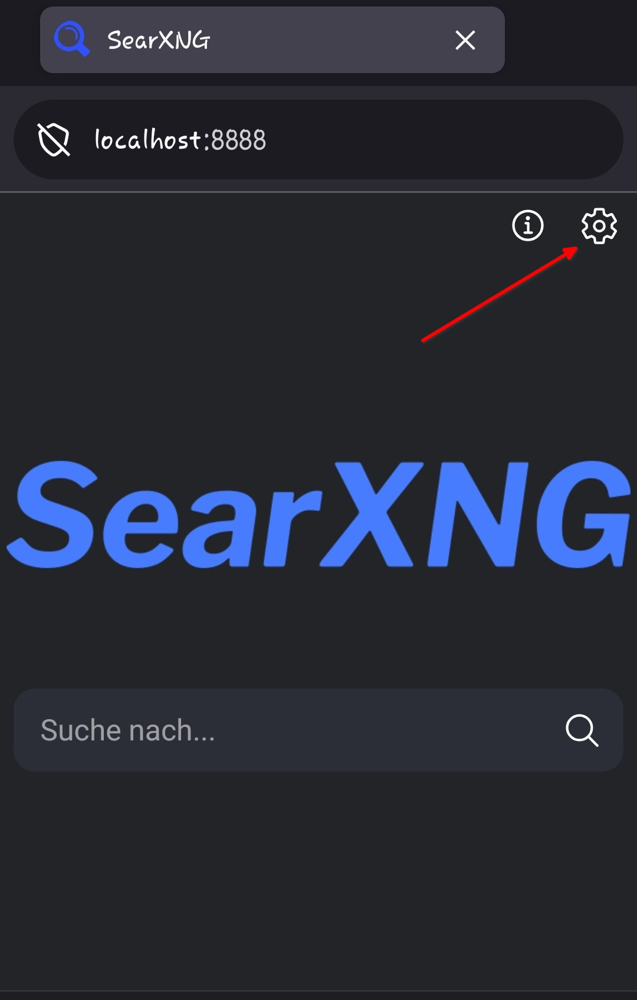
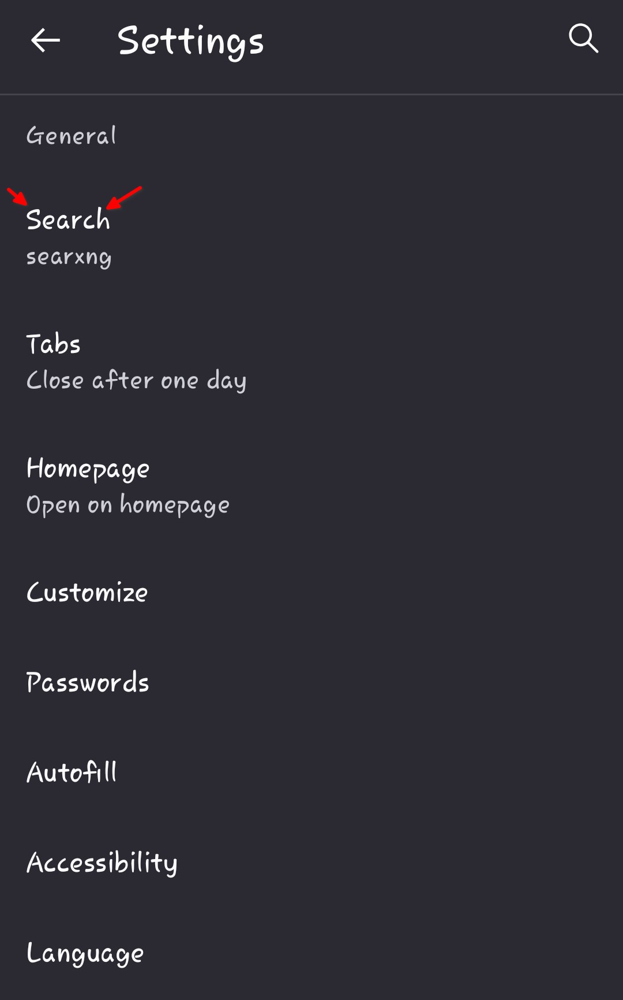
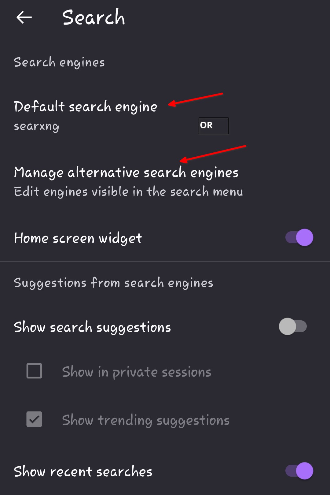
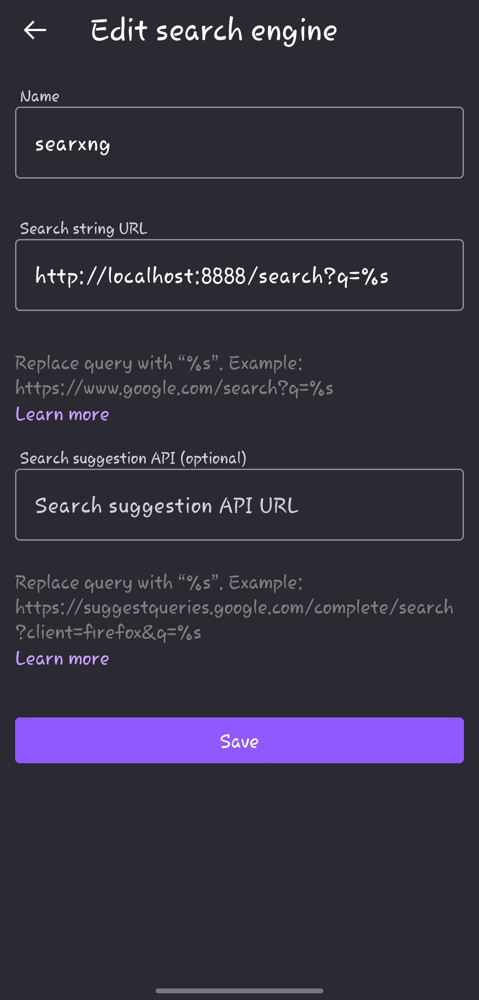

---

<p align="center">
  
  
  
</p>


<h1 align="center"><code>SearXNG on Termux Android</code></h1>

<h2 align="center"><code>(without Root & proot-distro)</code></h2>

<p align="center">
  <b><code>Lightweight • Private • Fully On‑Device</code></b>
</p>


# Complete Installation, Configuration, and Administration Guide

This guide describes how to install, configure, and use SearXNG on a non‑rooted Android device with Termux — without proot‑distro, using Termux:Widget and the pkg Python environment.
It includes:
- Full installation steps
- Configuration instructions
- Start/stop scripts for Termux:Widget
- Browser integration
- Recommended settings

---
# Table of Contents
- [Complete Installation, Configuration, and Administration Guide](#complete-installation-configuration-and-administration-guide)
- [Table of Contents](#table-of-contents)
- [0. Quick Install](#0-quick-install)
  - [0.1 Option A (install Script)](#01-option-a-install-script)
  - [0.2 Option B (installation by yourself)](#02-option-b-installation-by-yourself)
    - [0.2.1 Installation](#021-installation)
    - [0.2.2 Start+Stop+Access](#022-startstopaccess)
- [**Start of Guide**](#start-of-guide)
- [1. Prerequisites](#1-prerequisites)
  - [1.1. Tested On](#11-tested-on)
- [2. Preparing Termux](#2-preparing-termux)
- [3. Cloning SearXNG Source Code](#3-cloning-searxng-source-code)
- [4. Creating a Python Virtual Environment](#4-creating-a-python-virtual-environment)
- [5. Installing Python build Tools and Dependencies](#5-installing-python-build-tools-and-dependencies)
- [6. Installing SearXNG and its Dependencies](#6-installing-searxng-and-its-dependencies)
- [7. Configure SearXNG](#7-configure-searxng)
- [8. How to run the SearXNG Instance](#8-how-to-run-the-searxng-instance)
  - [8.1. Option A](#81-option-a)
  - [8.2. Option B (not recommended)](#82-option-b-not-recommended)
  - [8.3 Possible Error Output](#83-possible-error-output)
- [9. Further Configurations and diagnostics](#9-further-configurations-and-diagnostics)
  - [9.1. Checking Port, IP](#91-checking-port-ip)
  - [9.2 Optional Configurations](#92-optional-configurations)
- [10. Setting up searXNG in your Browser](#10-setting-up-searxng-in-your-browser)
- [11. Saving Settings](#11-saving-settings)
- [12. Recommended Settings](#12-recommended-settings)

---
# 0. Quick Install

## 0.1 Option A (install Script)
> Automatic installation via script (recommended)
```bash
  git clone https://github.com/LukasSR04/SearXNG-Termux-Android-noRoot.git && cd SearXNG-Termux-Android-noRoot && bash scripts/install-searxng.sh
```


## 0.2 Option B (installation by yourself)
### 0.2.1 Installation
```bash
pkg update && pkg upgrade -y
pkg install -y git python libxml2 libxslt clang binutils nano curl openssl-tool
rm -rf ~/searxng-src ~/searxng-pyenv ~/.config/searxng
git clone "https://github.com/searxng/searxng" ~/searxng-src
cd ~/searxng-src
git checkout b5bb27f231e5f24b3985cd7cbd3f371486c21a11
sed -i 's/msgspec==0\.20\.0/msgspec>=0.20.0/' ~/searxng-src/requirements.txt
sed -i 's/msgspec==0\.20\.0/msgspec>=0.20.0/' ~/searxng-src/pyproject.toml
cd
python -m venv searxng-pyenv
source searxng-pyenv/bin/activate
pip install --upgrade pip setuptools wheel pyyaml pybind11 msgspec typing_extensions
cd ~/searxng-src
pip install --use-pep517 --no-build-isolation -e .
mkdir -p ~/.config/searxng
cp ~/searxng-src/searx/settings.yml ~/.config/searxng/settings.yml

cat << 'EOF' > ~/searxng-src/generate_secret.py
import os, yaml
p=os.path.expanduser("~/.config/searxng/settings.yml")
s=yaml.safe_load(open(p))
s["server"]["secret_key"]=os.urandom(24).hex()
yaml.dump(s, open(p,"w"))
EOF

python ~/searxng-src/generate_secret.py
```
### 0.2.2 Start+Stop+Access
>Start
```bash
termux-wake-lock
source ~/searxng-pyenv/bin/activate
export SEARXNG_SETTINGS_PATH=~/.config/searxng/settings.yml
python ~/searxng-src/searx/webapp.py
```
>Stop
```bash
pkill -f searx/webapp.py
unset SEARXNG_SETTINGS_PATH
termux-wake-unlock
```
>Access

>http://localhost:8888/
or
>http://127.0.0.1:8888/
---

# **Start of Guide**
---

# 1. Prerequisites

>**Device specifications:**
- Minimum 4GB RAM
- Minimum 2GB storage space
- F-Droid app store installed

>**Apps from F-Droid Appstore:**
* Termux: https://f-droid.org/en/packages/com.termux/
* Termux:Widget: https://f-droid.org/en/packages/com.termux.widget/

> *Optional*:
- *Connection to Phone via SSH because typing in the terminal with the smartphone keyboard sucks ass.*

## 1.1. Tested On
| Component| Details|
|---|---|
| Device| Samsung Galaxy A34 5G (SM-A346B)|
| Manufacturer| Samsung|
| Android Version| 16|
| Kernel| 6.6.82-android15-8-abA346BXXSDEYL2-4k|
| Architecture| aarch64 (arm64-v8a)|
| RAM| 6 GB real RAM + 6 GB RAM Plus (Swap)|
| Termux Version| 0.118.3 (F-Droid)|
| Termux Tools Version| 1.45.0|
| Python Version| 3.12.12|
| pip Version| 26.0.1|
| OpenSSL Version| 3.6.1 (27 Jan 2026)|
| SearXNG Commit| b5bb27f231e5f24b3985cd7cbd3f371486c21a11|
| Termux Plugins| Termux:Widget (versionCode 1001)|


---
# 2. Preparing Termux

> Delete old searXNG files (only if they existed)
```
rm -rf ~/searxng-src
rm -rf ~/searxng-pyenv
rm -rf ~/.config/searxng
```

>update Termux packages
```bash
pkg update && pkg upgrade -y
pkg install -y git python libxml2 libxslt clang binutils nano curl openssl-tool
```

---
# 3. Cloning SearXNG Source Code

> cloning the source code
```bash

git clone "https://github.com/searxng/searxng" ~/searxng-src

cd ~/searxng-src
git checkout b5bb27f231e5f24b3985cd7cbd3f371486c21a11

```

---
# 4. Creating a Python Virtual Environment

> using a virtual environment keeps SearXNG dependencies isolated from the main Termux Python installation
```bash
cd ~
python -m venv searxng-pyenv
```

> activating Python
```bash
source searxng-pyenv/bin/activate
```
> the prompt will change to (searxng-pyenv) ~$ indicating the virtual environment is active

---

# 5. Installing Python build Tools and Dependencies
>while the virtual environment is active
```bash
pip install --upgrade pip setuptools wheel pyyaml pybind11 msgspec 
pip install --upgrade typing_extensions

```


---
# 6. Installing SearXNG and its Dependencies

>Navigate into the cloned source directory and install SearXNG in editable mode (-e .). 
```bash
cd ~/searxng-src
pip install --use-pep517 --no-build-isolation -e .
```
> if an error occurs, then start again with step 5.


---
# 7. Configure SearXNG
>create the configuration directory, then copy the default settings.yml and generate a unique secret_key
>The Python environment must still be active

```bash
mkdir -p ~/.config/searxng

cp ~/searxng-src/searx/settings.yml  ~/.config/searxng/settings.yml
```

> generate secret_key file
```bash
touch ~/searxng-src/generate_secret.py
```
```bash
cat << 'EOF' > ~/searxng-src/generate_secret.py
import os
import yaml

settings_path = os.path.expanduser("~/.config/searxng/settings.yml")
with open(settings_path, "r") as f:
  settings = yaml.safe_load(f)
settings["server"]["secret_key"] = os.urandom(24).hex()
with open(settings_path, "w") as f:
  yaml.dump(settings, f, default_flow_style=False)

EOF
```
```bash
python ~/searxng-src/generate_secret.py
```

---

# 8. How to run the SearXNG Instance
## 8.1. Option A
> You can create start and stop shortcuts with the Termux:Widget App, because typing in the Smartphone terminal really sucks
> For this the Termux:Widget App has to be installed from F-Droid and opened once to allow the requested system permissions

> First check if the App already created the "~/.shortcuts" Folder in the home Directory 
```bash
cd

ls -a ~ | grep .shortcuts
``` 
>if the Output contains ".shortcuts" you can go on. If the folder is not listed then you need to make one with:
```bash
mkdir ~/.shortcuts
```

>After that you need to create Bash Scripts for the Widget App to use

> Creating the start and stop scripts. 
```bash
touch ~/.shortcuts/start-searxng.sh ~/.shortcuts/stop-searxng.sh
```
```bash
cat << 'EOF' >  ~/.shortcuts/start-searxng.sh
#!/data/data/com.termux/files/usr/bin/bash

# Activate WakeLock to prevent searxng from closing in the background
termux-wake-lock

# start Virtual Environment
source ~/searxng-pyenv/bin/activate

sleep 2

# Go to Searxng Folder
cd ~/searxng-src


# Export with corrected Path for webapp.py to prevent errors
export SEARXNG_SETTINGS_PATH=~/.config/searxng/settings.yml

# Start searxng in the background
python /data/data/com.termux/files/home/searxng-src/searx/webapp.py&

# Confirmation Messages
echo -e "\e[32m SearXNG has been started in the background! \e[0m\n"

addr=$(grep -E "^[[:space:]]*bind_address:" ~/.config/searxng/settings.yml | head -n 1 | awk -F': *' '{print $2}' | tr -d '"'\'' ')
port=$(grep -E "^[[:space:]]*port:" ~/.config/searxng/settings.yml | head -n 1 | awk -F': *' '{print $2}' | tr -d '"'\'' ')


echo -e "\e[32m SearXNG is using the address:\e[0m  $addr\n"
echo -e "\e[32m And uses the port: \e[0m $port\n"

echo -e "\e[32m And is accessible with the URL: \e[0m"
echo -e "http://$addr:$port/\n"


sleep 1

echo -e "\e[32m This Window will close in 8 Seconds! \e[0m\n"

sleep 8

exit 0

EOF
```

```bash

cat << 'EOF' > ~/.shortcuts/stop-searxng.sh
#!/data/data/com.termux/files/usr/bin/bash

# kill SearXNG process
pkill -f searx/webapp.py

unset SEARXNG_SETTINGS_PATH

termux-wake-unlock

echo -e '\e[33m SearXNG and wake-lock has been stopped! \e[0m'

sleep 1

echo -e '\e[33m This Window will close in 2 Seconds \e[0m'


sleep 2

exit 0

EOF
```
```bash
chmod +x ~/.shortcuts/stop-searxng.sh ~/.shortcuts/start-searxng.sh
```


> By picking the second Option like in the picture shows you can create a Termux:Widget Widget on your start page where the Scripts in the ~/.shortcuts Folder are displayed and Executable



> Just refresh the Widget by pressing the refresh symbol and it should display your bash start & stop Scripts


## 8.2. Option B (not recommended)
> I really **don't recommend** it but you can of course start searXNG without shortcuts and widgets but inside the termux-terminal (why though?).

> for starting searXNG in the  Background
```bash
termux-wake-lock
source ~/searxng-pyenv/bin/activate
cd ~/searxng-src
export SEARXNG_SETTINGS_PATH=~/.config/searxng/settings.yml
python /data/data/com.termux/files/home/searxng-src/searx/webapp.py&
```

> for stopping searXNG
```bash
pkill -f searx/webapp.py
termux-wake-unlock
```


---

## 8.3 Possible Error Output
> After starting SearXNG you may see an Error like this:
```bash
2026-02-15 09:40:22,022 ERROR:searx.engines: loading engine ahmia failed: set engine to inactive!
2026-02-15 09:40:22,177 ERROR:searx.engines: loading engine torch failed: set engine to inactive!
2026-02-15 09:40:22,245 WARNING:searx.botdetection.config: missing config file: /data/data/com.termux/files/home/.config/searxng/limiter.toml
```
> These messages are completely normal and can be ignored.
> The ahmia and torch engines do not work on Android and are automatically set to inactive by SearXNG. You do not need to disable them manually in settings.yml.

> The botdetection warning can also be ignored.
> If you followed this guide, you did not create a limiter.toml file. In that case, 
> SearXNG simply uses the built‑in default limiter configuration, which is perfectly fine for local use.

---

# 9. Further Configurations and diagnostics
> after you start searxng with the method of your liking you should check the process and configurations in Order to not risk any future troubles

## 9.1. Checking Port, IP 

> For checking the Address on which SearXNG is accessible on your device you have to make sure it is a local Device IP like 127.0.0.1 or localhost and **NOT** 0.0.0.0 or some other IP, so it is only accessible on your Android Device.  

> IP and Port  check. The output of the Following Commands should display the IP and port. 
```bash
grep -E "bind_address|port" ~/.config/searxng/settings.yml
```
> It should show something like:
```bash
bind_address: "localhost"
  port: 8888
```
> or 
```bash
bind_address: "127.0.0.1"
  port: 8888
```


> Access check. If the IP and Port are correct you should check if the search engine is loaded. For this you need to curl the site with the URL ( http://bind_address:port/)
> For example:
```bash
curl http://127.0.0.1:8888/
```
> If the output is some long HTML Script and **NOT** "*curl: (7) Failed to connect to 127.0.0.1 port 8888 after 1 ms: Could not connect to server*" or something similar then you are good to go

## 9.2 Optional Configurations
> If you know your way around then you can also alter the configuration File to your liking to edit for example the IP, PORT or preconfiguring search engines and many other settings  

```bash
nano ~/.config/searxng/settings.yml
```


---

# 10. Setting up searXNG in your Browser 

> since searXNG is running on your local Device IP you can access it by typing:
> http://bind_address:port/ in your browser

For example:
```
http://localhost:8888
```


> Most good browsers nowadays allow you to add your own URLs as the default search engine. I will explain how to do this in the following points for the Firefox App but the steps could be applied to other browsers.

>First check if your browser can access your Engine by typing the URL in the Address bar. You should see something like this:




> switch to your browser settings and press the *Search* button in *General*





> Then press the *Default search engine* or *Manage alternative search engines* Button





> After that you have to add a search engine. Then type in your URL and the Name you want. The Search URL consists of bind_address, port and query String: 

> http://bind_address:port/search?q=%s

> For example:





> After that set searxng as your default and then you’re good to go

---

# 11. Saving Settings
> Searxng can be modified by typing in the URL with a /preferences (for example: http://localhost:8888/preferences) or by pressing the gear symbol at the startpage of Searxng.

> All settings you modify that way  are stored as Cookies in your browser, if your browser is deleting cookies by default then you have to change the settings in the file ~/.config/searxng/settings.yml to make them the default. So ensure your browser won't delete your cookies.

> To save your settings you can go to the category Cookies in the searxng settings menu and then copy the settings as URL or as text to copy it into another browser or just to save your preset

> Note it matters if you access the engine with http://localhost:8888/ or http://127.0.0.1:8888/. Both URL are essentially the same for your Device and searxng but your browser will save different settings cookies for each of the URLs so make sure to access Searxng only with localhost **OR** 127.0.0.1


---

# 12. Recommended Settings

General:
  - Autocomplete: duckduckgo

Privacy:
  - HTTP Method: POST

  - Picture Proxy: on (can decrease performance)

  - Tracker-URL-Remover: ON

Engines:
  - wikimedia: ON

  - The default settings are fine

Special Queries:
  - Everything ON except Tor Test Plugin

---

---

**SearXNG** is licensed under the **AGPLv3**.  
**Termux**, **Android**, and **F‑Droid** are trademarks of their respective owners.

---

Shield: [![CC BY 4.0][cc-by-shield]][cc-by]

This work is licensed under a
[Creative Commons Attribution 4.0 International License][cc-by].

[![CC BY 4.0][cc-by-image]][cc-by]

[cc-by]: http://creativecommons.org/licenses/by/4.0/
[cc-by-image]: https://i.creativecommons.org/l/by/4.0/88x31.png
[cc-by-shield]: https://img.shields.io/badge/License-CC%20BY%204.0-lightgrey.svg
